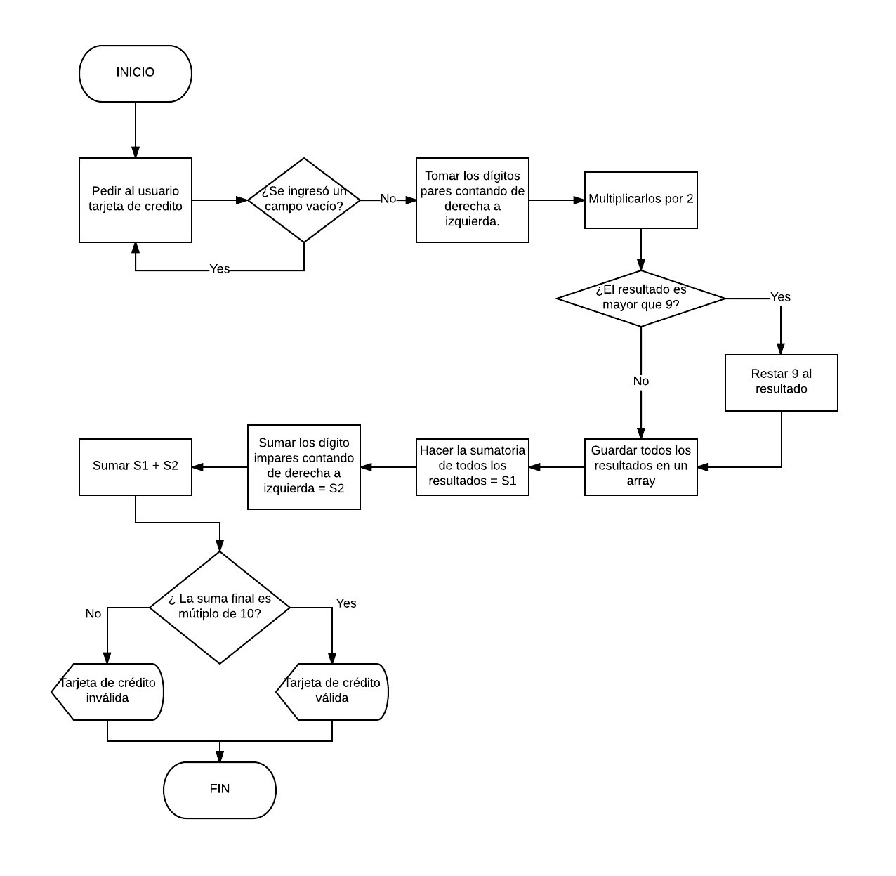

# Tarjeta de crédito válida

Código que pide al usuario el número de su tarjeta de crédito mediante un prompt, para luego validarlo según el algoritmo de Luhn con la función isValidCard.

## Pseudocódigo

FUNCION isValidCard de creditCard{

centinel = false  
evenDigits = []  
sum = 0  

Si (creditCard = '') &rarr;
Alerta 'No puede ingresar un campo vacío'  
**RETORNA centinel = false**

BUCLE for (Iniciar i en creditCard.length - 2; validar si es >= 0; disminuir en 2){  
Si ([Dígito en posición i] * 2 &rarr;
  ([Dígito en posición i] * 2 - 9) ingresa como elemento de evenDigits  
Sino &rarr; ([Dígito en posición i] * 2) ingresa como elemento de evenDigits}  

BUCLE for (Iniciar i en creditCard.length -1; validar si es >= 0; disminuir en 2){  
sum = sum + [Dígito en posición i]}

BUCLE for (Iniciar i en 0; validar que sea menor que evenDigits.length; aumentar en 1){  
sum = sum + [Elemento en posición i] 
}

Si (sum % 10 == 0) &rarr; Alerta 'Tarjeta válida' &rarr; centinel = true  
Sino &rarr; Alerta 'Tarjeta inválida' &rarr; centinel = false

**RETORNA centinel**

## Diagrama de flujo

